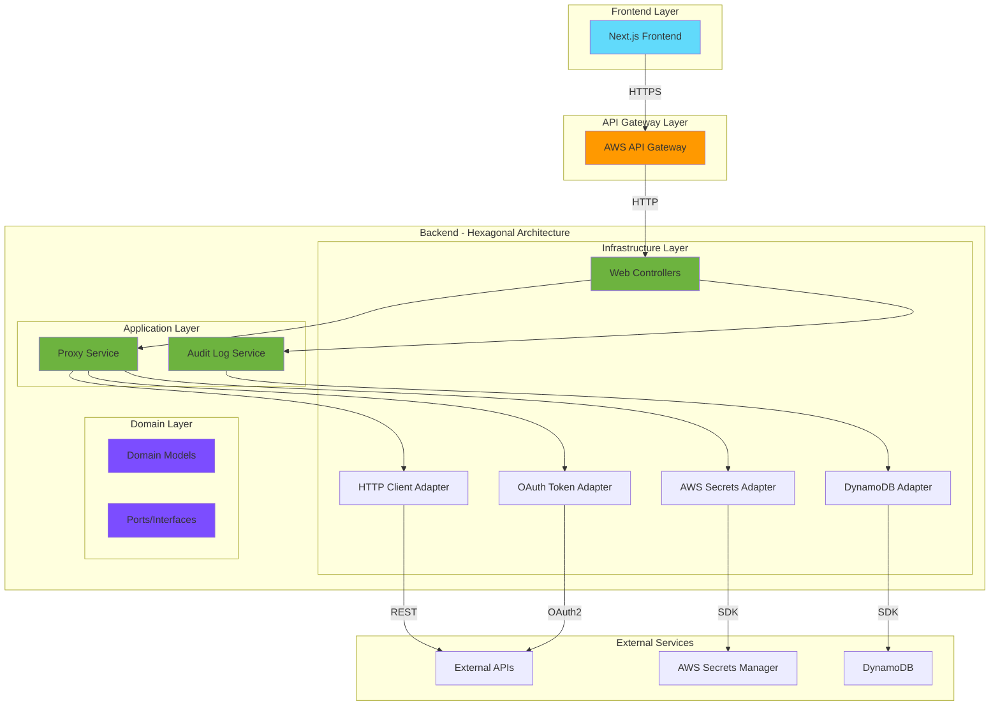
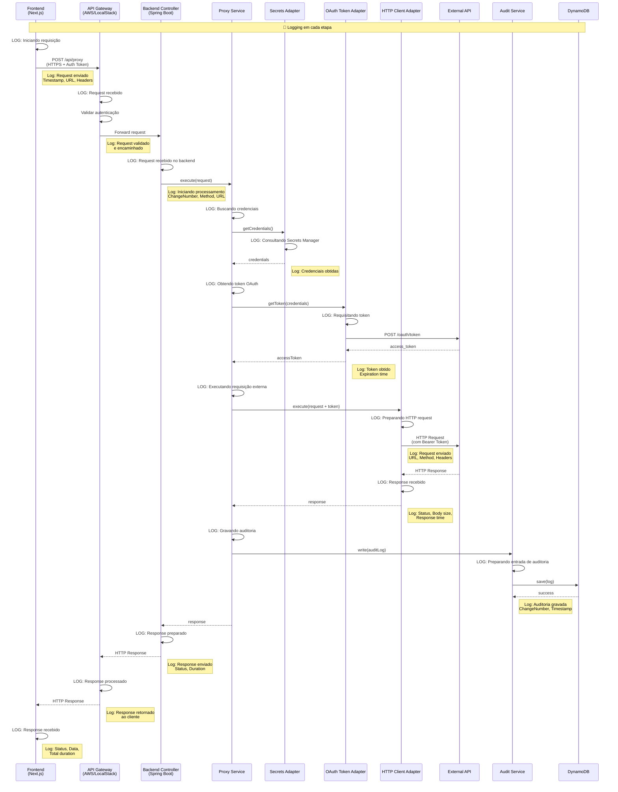
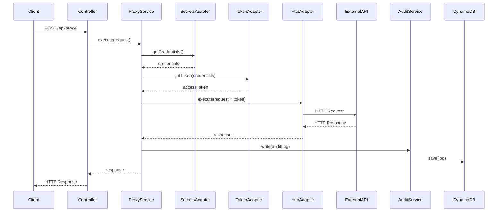
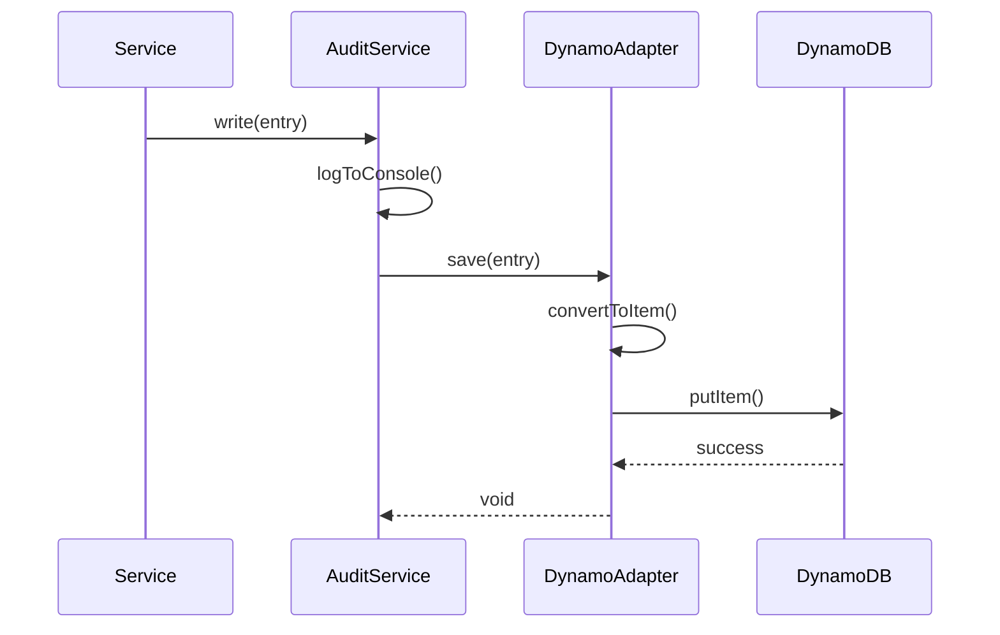
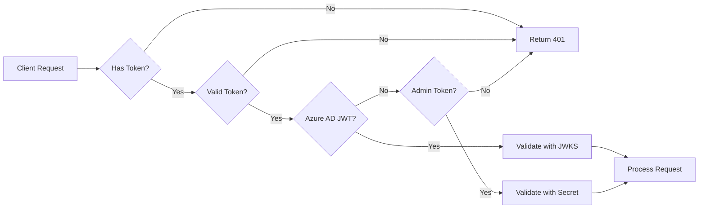

# Arquitetura do Sistema

## 📋 Visão Geral

O API Generic Consumer Backend é construído usando **Arquitetura Hexagonal** (Ports & Adapters), promovendo separação de responsabilidades, testabilidade e independência de frameworks.

## 🏗️ Diagrama de Arquitetura



## 🎯 Arquitetura Hexagonal

### Camadas

#### 1. **Domain Layer** (Núcleo)
Contém a lógica de negócio pura, independente de frameworks e tecnologias.

```
domain/
├── model/              # Entidades e Value Objects
│   ├── ApiRequest.kt
│   ├── ApiResponse.kt
│   ├── ApiCredentials.kt
│   └── AuditLogEntry.kt
└── port/               # Interfaces (Contratos)
    ├── input/          # Casos de uso
    │   ├── ExecuteProxyUseCase.kt
    │   └── WriteAuditLogUseCase.kt
    └── output/         # Portas de saída
        ├── HttpClientPort.kt
        ├── TokenProviderPort.kt
        ├── SecretsManagerPort.kt
        └── AuditLogRepositoryPort.kt
```

**Características:**
- Sem dependências externas
- Apenas lógica de negócio
- Testável isoladamente
- Define contratos (ports)

#### 2. **Application Layer**
Implementa os casos de uso orquestrando o domínio.

```
application/
└── service/
    ├── ProxyService.kt      # Implementa ExecuteProxyUseCase
    └── AuditLogService.kt   # Implementa WriteAuditLogUseCase
```

**Responsabilidades:**
- Orquestrar chamadas ao domínio
- Coordenar múltiplas operações
- Gerenciar transações
- Aplicar regras de negócio

#### 3. **Infrastructure Layer**
Implementa os adaptadores para tecnologias específicas.

```
infrastructure/
├── adapter/
│   ├── input/
│   │   └── web/
│   │       ├── ProxyController.kt
│   │       ├── AuditLogController.kt
│   │       └── AuthController.kt
│   └── output/
│       ├── http/
│       │   └── OkHttpClientAdapter.kt
│       ├── oauth/
│       │   └── OAuthTokenAdapter.kt
│       ├── aws/
│       │   └── AwsSecretsAdapter.kt
│       └── dynamodb/
│           └── DynamoDbAuditLogAdapter.kt
└── config/
    ├── ApplicationConfig.kt
    ├── AwsConfig.kt
    ├── DynamoDbConfig.kt
    ├── SecurityConfig.kt
    └── WebConfig.kt
```

**Responsabilidades:**
- Implementar portas de entrada (controllers)
- Implementar portas de saída (adapters)
- Configurar frameworks
- Gerenciar dependências externas

## 🔄 Fluxo de Dados

### 1. Fluxo Completo com API Gateway



### 2. Requisição de Proxy (Detalhado)



### 2. Gravação de Audit Log



## 🔐 Segurança

### Autenticação e Autorização



### Fluxo de Credenciais

1. **Armazenamento**: Credenciais em AWS Secrets Manager
2. **Recuperação**: Adapter busca credenciais via SDK
3. **Cache**: Credenciais cacheadas em memória (opcional)
4. **Uso**: Token OAuth2 obtido e usado nas requisições
5. **Renovação**: Token renovado automaticamente quando expira

## 📊 Modelo de Dados

### DynamoDB - Audit Logs

```
Table: audit-logs
Partition Key: changeNumber (String)
Sort Key: timestamp (String)
TTL: ttl (Number) - 30 dias

Attributes:
- changeNumber: Identificador da sessão
- timestamp: ISO 8601 timestamp
- level: SESSION_OPEN | CALL | SESSION_CLOSE | SESSION_SUMMARY | FULL_REPORT
- message: Mensagem descritiva
- tableData: JSON string (opcional)
- ttl: Unix timestamp para expiração
```

### Secrets Manager - API Credentials

```json
{
  "clientId": "string",
  "clientSecret": "string",
  "tokenUrl": "string",
  "scope": "string (optional)"
}
```

## 🚀 Deployment

### Ambientes

#### Local (Development)
```
Frontend (localhost:3000)
    ↓
LocalStack API Gateway (localhost:4566)
    ↓
Backend (localhost:8080)
    ↓
LocalStack DynamoDB (localhost:4566)
```

#### AWS (Production)
```
CloudFront + S3 (Frontend)
    ↓
API Gateway
    ↓
EKS/ECS (Backend)
    ↓
DynamoDB
```

## 🔧 Configuração

### Variáveis de Ambiente por Ambiente

| Variável | Local | Dev | Prod |
|----------|-------|-----|------|
| `AWS_REGION` | us-east-1 | us-east-1 | us-east-1 |
| `AWS_DYNAMODB_ENDPOINT` | http://localhost:4566 | - | - |
| `SPRING_PROFILES_ACTIVE` | local | dev | prod |
| `CORS_ALLOWED_ORIGINS` | http://localhost:3000 | https://dev.example.com | https://example.com |

## 📈 Escalabilidade

### Horizontal Scaling
- Backend stateless
- Múltiplas instâncias via Kubernetes
- Load balancing via API Gateway

### Vertical Scaling
- Ajuste de recursos (CPU/Memory)
- JVM tuning
- Connection pooling

### Caching Strategy
- Token OAuth2 em memória
- Credenciais cacheadas (5 min)
- HTTP client connection pool

## 🔍 Observabilidade

### Logs
- Structured logging (JSON)
- Níveis: ERROR, WARN, INFO, DEBUG
- Contexto: requestId, changeNumber, userId

### Métricas (Actuator)
- Health checks
- JVM metrics
- HTTP metrics
- Custom business metrics

### Tracing
- Request ID propagation
- Distributed tracing ready
- Integration with CloudWatch/X-Ray

## 🧪 Testabilidade

### Estratégia de Testes

```
Unit Tests (80%)
├── Domain Layer: 100%
├── Application Layer: 90%
└── Infrastructure Layer: 70%

Integration Tests (15%)
├── Controller → Service
├── Adapter → External Service
└── Database operations

E2E Tests (5%)
└── Full flow with LocalStack
```

### Test Doubles

- **Mocks**: Para portas de saída
- **Stubs**: Para respostas fixas
- **Fakes**: Para implementações in-memory

## 🔄 Evolução da Arquitetura

### Próximos Passos

1. **Event-Driven**: Adicionar eventos de domínio
2. **CQRS**: Separar comandos de queries
3. **Saga Pattern**: Para transações distribuídas
4. **Circuit Breaker**: Resiliência em chamadas externas
5. **Rate Limiting**: Controle de taxa de requisições

## 📚 Referências

- [Hexagonal Architecture](https://alistair.cockburn.us/hexagonal-architecture/)
- [Clean Architecture](https://blog.cleancoder.com/uncle-bob/2012/08/13/the-clean-architecture.html)
- [Domain-Driven Design](https://martinfowler.com/bliki/DomainDrivenDesign.html)
- [Spring Boot Best Practices](https://docs.spring.io/spring-boot/docs/current/reference/html/)

---

**Última atualização**: 2024-05-05