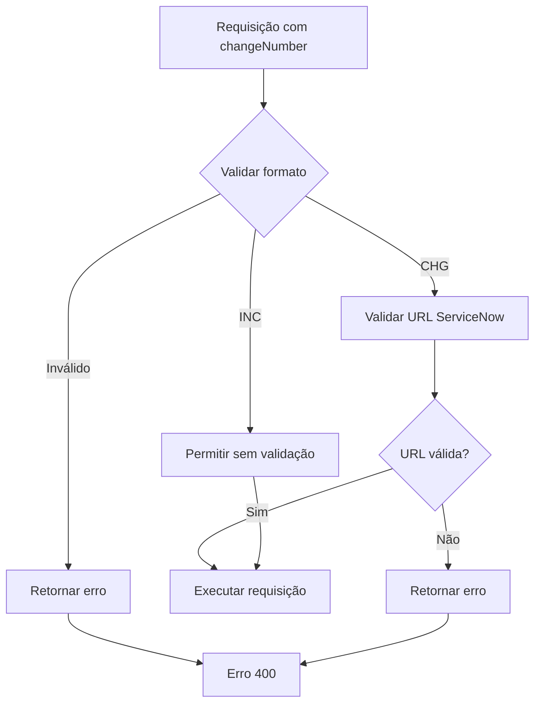

# ServiceNow Integration

Este documento descreve a integração com ServiceNow para validação de GMUD (Gerenciamento de Mudanças).

## 🎯 Objetivo

Validar se uma mudança de API está associada a uma GMUD do ServiceNow, distinguindo entre:
- **CHG**: Mudanças do ServiceNow (requer validação específica)
- **INC**: Incidentes e outras mudanças (não requer validação ServiceNow)

## 🔧 Configuração

### Variáveis de Ambiente

```bash
# Habilitar/desabilitar validação ServiceNow
SERVICENOW_ENABLED=true

# Configurações do ServiceNow
SERVICENOW_BASE_URL=https://seu-instance.service-now.com
SERVICENOW_USERNAME=seu-usuario
SERVICENOW_PASSWORD=sua-senha
```

### application.yml

```yaml
app:
  servicenow:
    enabled: ${SERVICENOW_ENABLED:false}
    base-url: ${SERVICENOW_BASE_URL:}
    username: ${SERVICENOW_USERNAME:}
    password: ${SERVICENOW_PASSWORD:}
```

## 🚀 Funcionalidades

### 1. Validação de Número de Mudança

A API valida automaticamente o formato do número de mudança:

- **CHGXXXXXX**: Identificado como mudança ServiceNow
- **INCXXXXXX**: Identificado como incidente (não ServiceNow)
- **Outros**: Formato inválido

### 2. Validação de URL ServiceNow

Para mudanças CHG, a API valida se a URL segue padrões ServiceNow:

- `/api/now/*` - Table API
- `/api/itsm/*` - ITSM API
- `/sys_script*` - Scripts
- `/sys_attachment*` - Anexos
- `/incident*` - Incidentes
- `/change_request*` - Change Requests
- `/task*` - Tasks

## 📚 Endpoints

### POST /api/proxy

Endpoint principal de proxy com validação ServiceNow integrada.

**Request Body:**
```json
{
  "url": "https://instance.service-now.com/api/now/table/incident",
  "method": "GET",
  "changeNumber": "CHG123456",
  "headers": [],
  "body": null
}
```

**Response com Validação:**
- **CHG válido**: Executa requisição normalmente
- **CHG inválido**: Retorna erro 400 com mensagem específica
- **INC**: Executa requisição sem validação ServiceNow
- **Formato inválido**: Retorna erro 400

### POST /api/servicenow/validate

Endpoint dedicado para validação ServiceNow.

**Request Body:**
```json
{
  "changeNumber": "CHG123456",
  "apiUrl": "https://instance.service-now.com/api/now/table/incident"
}
```

**Response:**
```json
{
  "isServiceNowApi": true,
  "changeType": "CHG",
  "isValid": true,
  "message": "Valid ServiceNow API for CHG CHG123456"
}
```

## 🔍 Fluxo de Validação



## 🧪 Testes

### Testes Unitários

```bash
./gradlew test --tests ServiceNowValidationServiceTest
```

### Testes de Integração

```bash
./gradlew integrationTest --tests ServiceNowIntegrationTest
```

### Testes Manuais

#### 1. Validação CHG Válido
```bash
curl -X POST http://localhost:8080/api/proxy \
  -H "Content-Type: application/json" \
  -d '{
    "url": "https://instance.service-now.com/api/now/table/incident",
    "method": "GET",
    "changeNumber": "CHG123456"
  }'
```

#### 2. Validação INC
```bash
curl -X POST http://localhost:8080/api/proxy \
  -H "Content-Type: application/json" \
  -d '{
    "url": "https://api.example.com/endpoint",
    "method": "GET",
    "changeNumber": "INC123456"
  }'
```

#### 3. Validação Direta
```bash
curl -X POST http://localhost:8080/api/servicenow/validate \
  -H "Content-Type: application/json" \
  -d '{
    "changeNumber": "CHG123456",
    "apiUrl": "https://instance.service-now.com/api/now/table/incident"
  }'
```

## 📊 Logs e Auditoria

A validação ServiceNow é registrada nos logs de auditoria:

```
INFO  ServiceNow validation for CHG123456: Valid ServiceNow API for CHG CHG123456
WARN  ServiceNow validation failed: URL does not appear to be a valid ServiceNow API endpoint
```

## 🚨 Cenários de Erro

### 1. Configuração Incompleta
```json
{
  "isServiceNowApi": true,
  "changeType": "CHG",
  "isValid": false,
  "message": "ServiceNow configuration is incomplete"
}
```

### 2. URL Inválida
```json
{
  "isServiceNowApi": true,
  "changeType": "CHG",
  "isValid": false,
  "message": "URL does not appear to be a valid ServiceNow API endpoint"
}
```

### 3. Formato Inválido
```json
{
  "isServiceNowApi": false,
  "changeType": "UNKNOWN",
  "isValid": false,
  "message": "Invalid change number format. Expected CHG or INC prefix."
}
```

## 🔧 Configuração em Ambientes

### Desenvolvimento
```bash
SERVICENOW_ENABLED=false
```

### Homologação
```bash
SERVICENOW_ENABLED=true
SERVICENOW_BASE_URL=https://dev-instance.service-now.com
SERVICENOW_USERNAME=dev-user
SERVICENOW_PASSWORD=dev-password
```

### Produção
```bash
SERVICENOW_ENABLED=true
SERVICENOW_BASE_URL=https://prod-instance.service-now.com
SERVICENOW_USERNAME=prod-user
SERVICENOW_PASSWORD=prod-password
```

## 📈 Monitoramento

### Métricas
- Taxa de sucesso de validação CHG
- Taxa de rejeição por URL inválida
- Tempo médio de validação

### Alerts
- Falha na validação ServiceNow
- Configuração incompleta detectada
- Alta taxa de rejeição

## 🤝 Contribuição

Para adicionar novos padrões de URL ServiceNow:

1. Atualizar `isValidServiceNowUrl()` em `ServiceNowValidationService`
2. Adicionar testes correspondentes
3. Atualizar documentação

## 📞 Suporte

- Issues: [GitHub Issues](https://github.com/rafaelakio/api-generic-consumer-backend/issues)
- Documentação: [docs/SERVICENOW_INTEGRATION.md](SERVICENOW_INTEGRATION.md)
